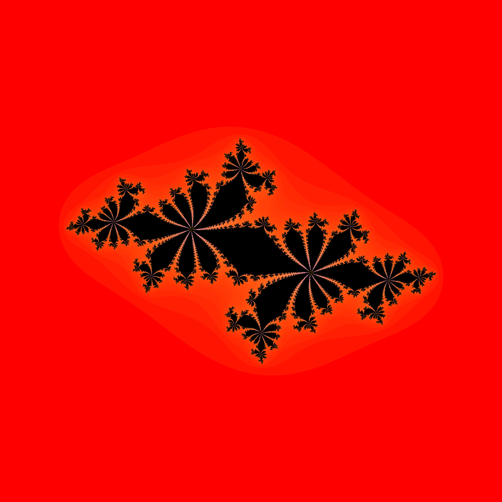
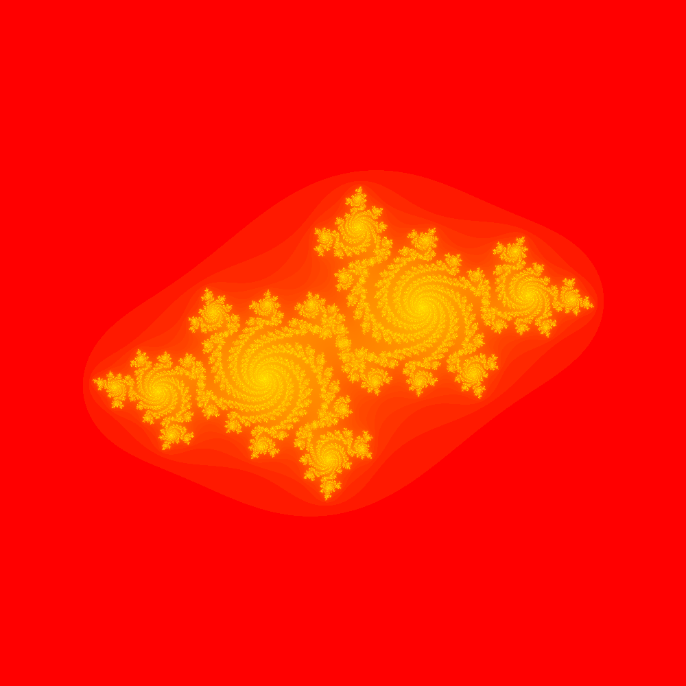
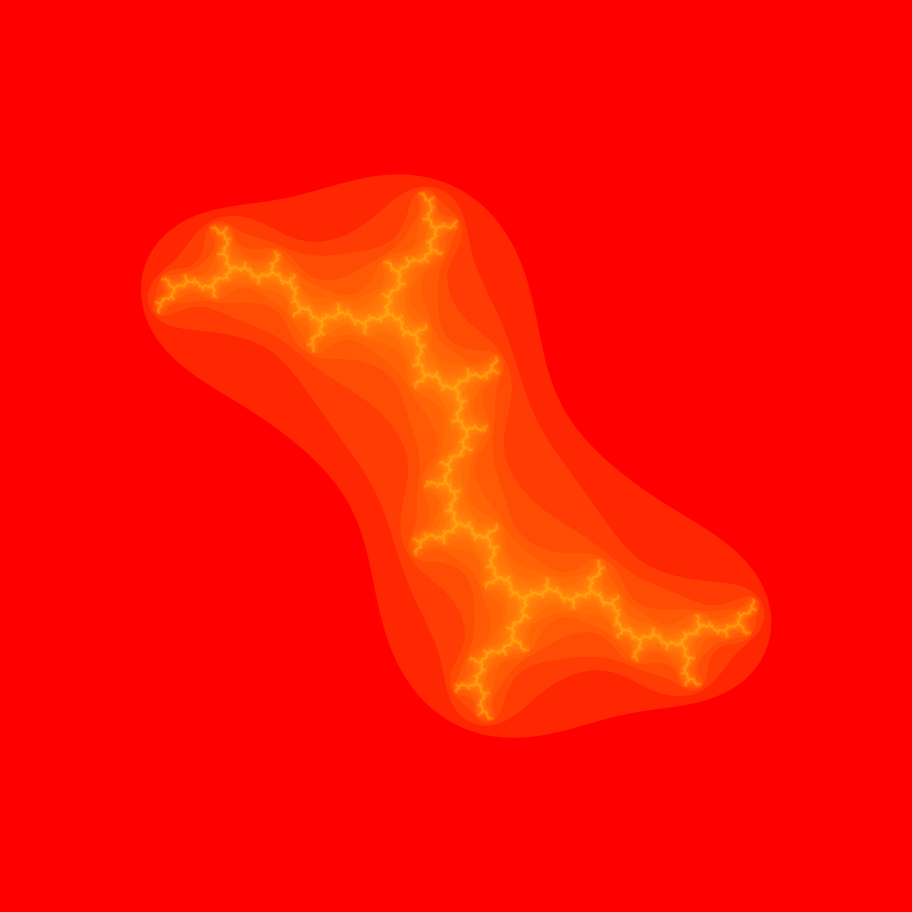
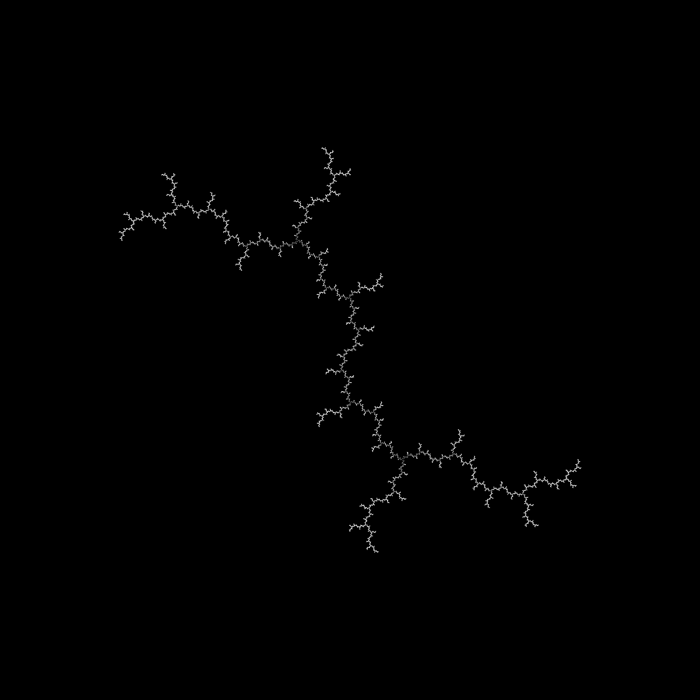
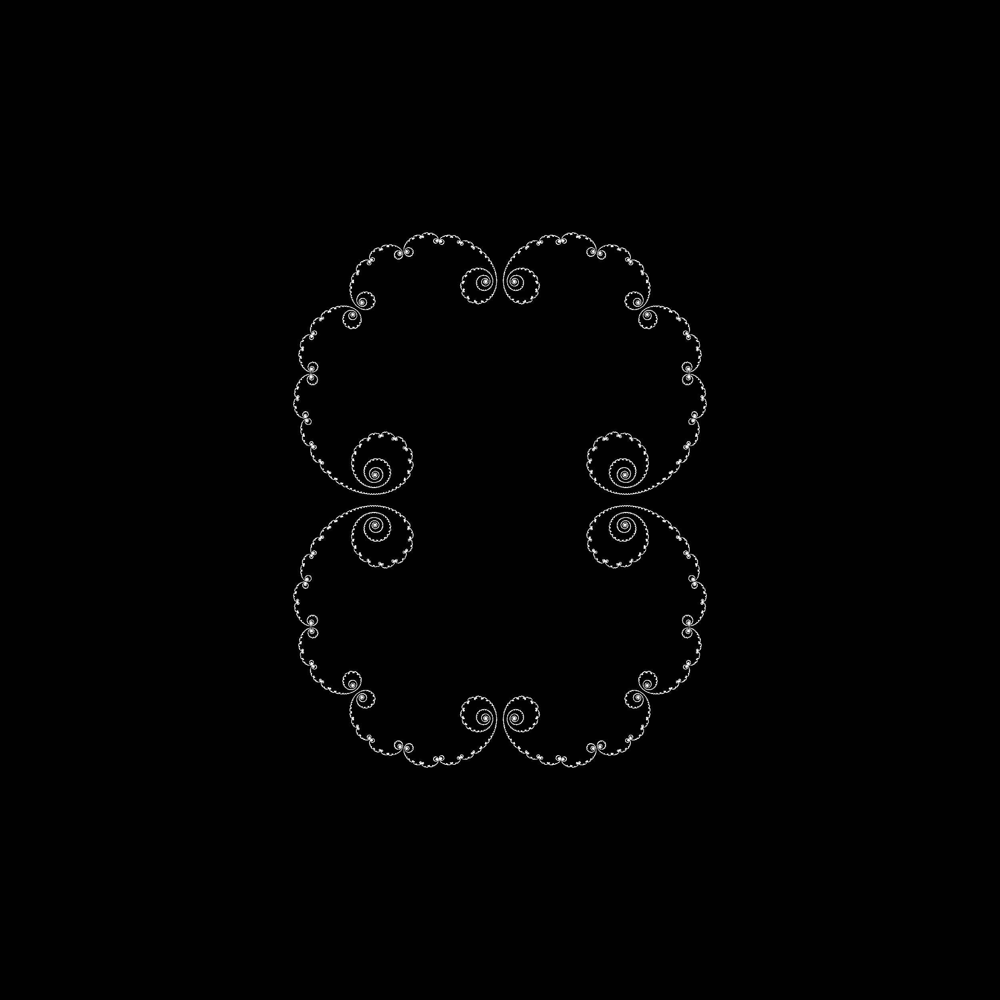

# Julia Set Generator

This program aims at the representation of the J<sub>c</sub>, K<sub>c</sub> and F<sub>c</sub>,
(Julia, Full Julia and Fatou) sets resulting on the iteration of different functions on the complex plane.

For now, the program is able to plot the results of the Quadratic family Q<sub>c</sub> (z) = z<sup>2</sup> + c, as well as any arbitrary polynomial:

f(z) = a<sub>n</sub> z<sup>n</sup> + a<sub>n-1</sub> z<sup>n-1</sup> + ... + a<sub>1</sub> z + c.

The program plots correctly the Full Julia Sets K<sub>c</sub> of the iteration of said functions, as well as the parameter spaces for said families,
given an arbitrary starting point z. When plotting polynomial functions, any component of the polynomial can be taken as parameter for plotting. This process is sped up by the use of the OpenCL library.

## Usage


## API

In order to plot the K<sub>c</sub> sets, the following function implements the so-called 'Scaping Algorithm':

```unsigned char *draw_julia(int N, int h, int w, double c[2], double Sx[2], double Sy[2], char *plot_type)```

Where ```N``` is the number of iterations of the Q<sub>c</sub> function, ```c``` is a tuple containing the real and imaginaty value of c,
```Sx``` and ```Sy``` are the ranges of numbers that will appear in the plot (allowing the user to zoom in on these sets), and ```plot_type``` can be ```rec_f``` or ```parameter_space```.
This will return a matrix of ```h*w*3``` bytes, corresponding to an RGB image of bitdepth 24. The image can then be encoded with the ```lodepng.h``` library, included in the source code.

In order to have an easier interfacing with this function, the program also implements the function

```void draw_julia_zoom(int frames, int N, int h, int w, double c[2], double p[2], char *plot_type)```

Which will generate ```frames+1``` images of the function (It will generate a ```Thumbnail.png``` image that shows the whole
plot of the function, as well as ```frames``` frames, each one progressively zooming on the point p.
This function doesn't return any values, as it will automatically generate an ```out/``` folder, and store all
resulting images by using the ```lodepng.h``` library.

In order to generate the J<sub>c</sub> sets, the function

`unsigned char *draw_julia_backwards_iteration(int N, int h, int w, double c[2], long MAX_D)`

is implemented, which draws the boundaries of the K<sub>c</sub> sets, that is, J<sub>c</sub>, by using the backwards-iteration method
with derivative value control. This function performs `N` iterations taking `c` as c, and cuts successors of any point
whose derivative is larger than `MAX_D`. Then returns a matrix of size `h*w`, which corresponds to a black and white image of the set.

## Results

### Full Julia Sets

The following images have been generated by the `draw_julia` function.

 

As we can see in the next images, when the resulting K<sub>c</sub> = J<sub>c</sub>, that is, when the
Full Julia Set doesn't have an interior, this function fails at coloring the sets black. This is why the
backwards iteration method is needded.

 

### Backwards Iteration Method

 

## Further development

As it is by now, the Backwards Iteration function can be a little difficult to operate, because chosing the appropiate
value for MAX_D for the desired results, computational time and memory consumption is not straight-forward.
This is why this function will be developed further in the near future. Also, a function will be implemented to
merge the results of both algorithms, in order to show these interior-less Julia sets with the colorful benefits
that the Scaping Algorithm brings.

Once these functionalities are added, there will be implemented a way to parse 'natural mathematic language' polynomials,
so that the program will be able to plot any arbitrary polynomial and its dynamics.

In the far future, a straight-forward graphical user interface will be created, where the user will be able to
input al of the needed parameters, and see the representation of these sets, zoom in with their mouse or keyboard,
in addition to being able to chose the c parameter just by clicking on the corresponding value in the representation of the Parameter Space.
