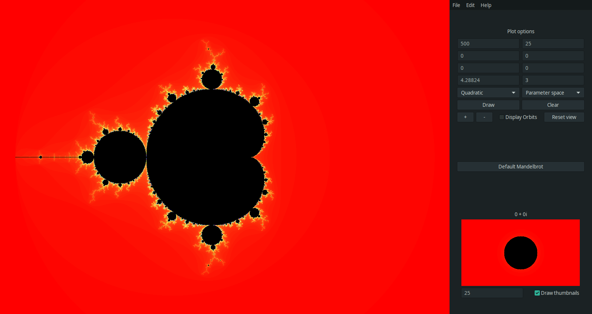
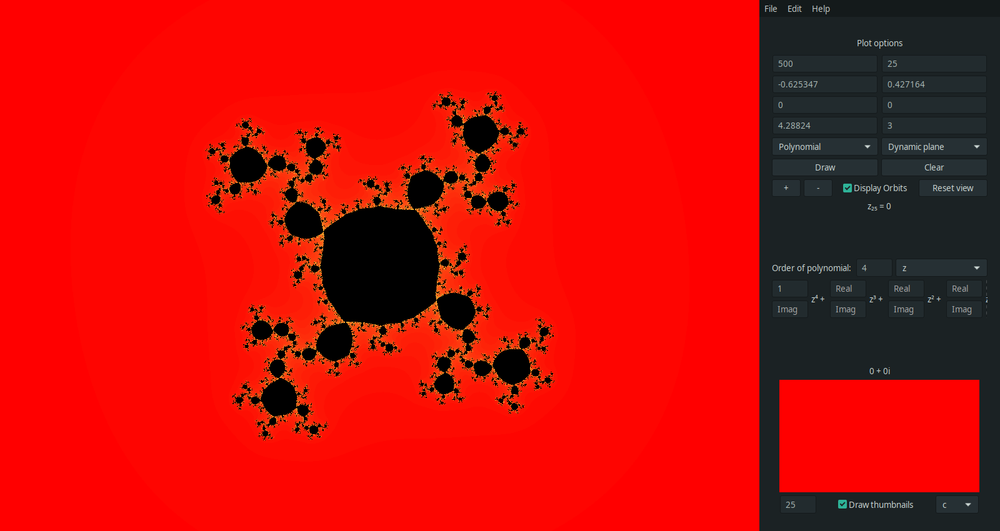
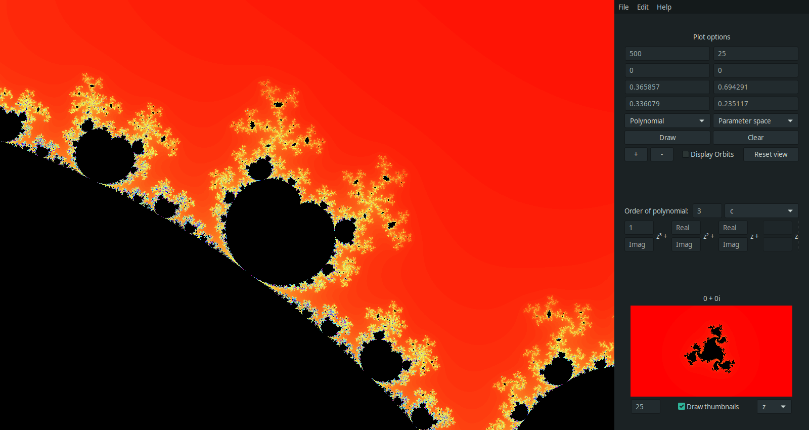

# Julia Set Generator

This program aims at the representation of the Jc, Kc and Fc,
(Julia, Full Julia and Fatou) sets resulting on the iteration of different functions on the complex plane.

For now, the program is able to plot the results of the Quadratic family Qc (z) = z2 + c, as well as any arbitrary polynomial:

f(z) = an zn + an-1 zn-1 + ... + a1 z + c.

The program plots correctly the Full Julia Sets Kc of the iteration of said functions, as well as the parameter spaces for said families,
given an arbitrary starting point z. When plotting polynomial functions, any component of the polynomial can be taken as parameter for plotting. This process is sped up by the use of the OpenCL library.

## Usage

### Main basic functionality

When program is first started, user will be greated with the following main window:

 

In it we can see the Mandelbrot set resulting from the iteration of the quadratic complex function Qc (z) = z2 + c, where z is fixed to be (0 + 0i) and c is moved across the complex plane. By moving our mouse across the plot, we can see the different orbits of z = (0 + 0i) across the plane, for the point c targeted by our cursor. Also, we can see in the bottom right of the window the dynamic plane resulting by fixing c to the selected point and by taking z as our parameter. These thumbnail plots are generated dynamically as we move our cursor. 

The functionality of showing the orbits as well as the dynamically generated thumbnails can be turned on or off by the user, if the computer running the program is not powerful enough, or for other reasons.

 

The white lines on the parameter space plot are the orbits of the fixed point z = (0 + 0i) for the targeted point c. Thus, all orbits in this parameter space come from the point (0 + 0i). If the user choses to change this z value, then the same will apply for said value. All orbits will begin on the point z selected by the user.

If we right-click on any point of the parameter space plot, the point c will be selected and the program will plot the corresponding dynamic function of Qc (z) = z2 + c, where we take z as our parameter.

 

The white lines seen on the plot are the orbits of the point z targeted by the mouse, with the parameter c fixed in some value. Thus, all orbits start from the mouse position while using the dynamic function plotting mode.

We can also select to plot any arbitrary polynomial function, not only this Quadratic family. With them, the functionality is the same, we just have to specify the parameters of said polynomial, or leave them blank for a value of 0, as we can see in the next image. When in polynomial mode, the plotting parameter can be specified by a drop-down menu. Then, when we point with our cursor to the plane, the point where the cursor is will be taken as such parameter, and the result will be plotted in the thumbnail area, plotting by the parameter specfied in the thumbnail options drop-down menu. This functionality can be seen in next picture.

 

In this picture we can see the parameter space obtained for the polynomial p(z) = z4 + c, where z = (0 + 0i) and c is taken as parameter. In the thumbnail screen we can see we are plotting taking z as parameter, and fixing c to the value pointed by our cursor. Again, this value can be selected by right-clicking, so the thumbnail plot will ocupy the big plot space, and the plotting parameters specified will be interchanged.

In this polynomial mode, the orbits can also be shown, however, they were turned off at the time of taking the screenshot to make the image clearer.

In the next picture we can see the result of fixing some point as c and plotting for z

 

In the thumbnails section we can also see the result of taking a1 as parameter, for the z value selected by the mouse cursor.

### More functionalities

The GUI includes as well different entry boxes that allow the user to tweak the options of the plotting algorithm, such as the number of iterations desired (more iterations take considerably longer to generate but also give more detail as we zoom in these sets), as well as the ability to select the point where the program should center the plot, the span in the X and Y directions that we want to plot, and the values for z and or c.

With the central mouse button we can select any point of the plot as the center, and replot everything, centered in said point.

The interface also includes zoom in and zoom out buttons, which zoom by a factor of 0.5 and 1.5 respectively. Also, the user can click and drag in the plot, selecting a region of the plane, to zoom in on said region. This functionality can be seen in the next screenshots:

 

 

## Results

### Full Julia Sets

The following images have been generated by the `draw_julia` function.

 

As we can see in the next images, when the resulting Kc = Jc, that is, when the
Full Julia Set doesn't have an interior, this function fails at coloring the sets black. This is why the
backwards iteration method is needded.

 

### Backwards Iteration Method

 

## Further development

The Quadratic Family plot generator functions have been optimized considerably. The next step will be to optimize the calculation of the polynomials. Furthermore, the ability to plot different numerical methods such as the Newton's method will be implemented. This is already a work in progress.

Also, there will be added a way of generating zooming videos on the points selected by the user.

Backwards iteration will be added to the GUI, both for quadratic functions as well as for polynomials. However, backwards iteration is not yet implemented for polynomials, and will not be done in the near future.
