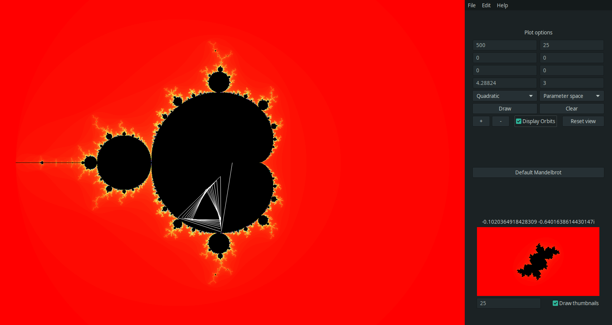
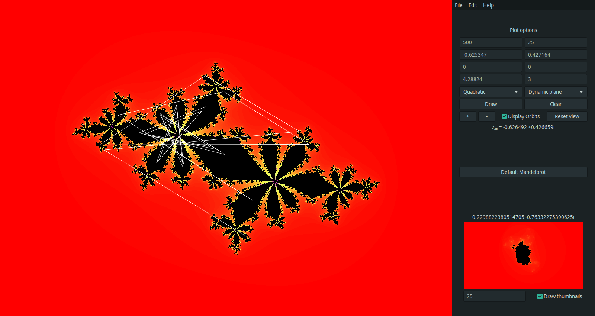
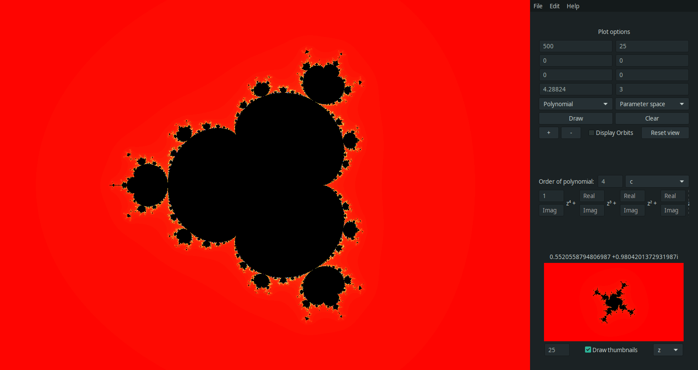
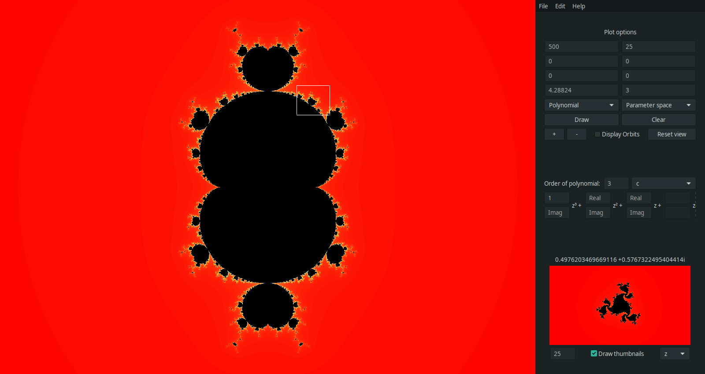

# Sempiternum

Sempiternum is a software developed to represent the J<sub>c</sub>, K<sub>c</sub> and F<sub>c</sub>,
(Julia, Full Julia and Fatou) sets resulting on the iteration of different functions on the complex plane, as well as their corresponding parameter spaces.

By default, the program will plot the parameter space resulting on iterating the Quadratic family Q<sub>c</sub> (z) = z<sup>2</sup> + c, taking c as a parameter, also known as the Mandelbrot Set.

Also, any arbitrary polynomial

f(z) = a<sub>n</sub> z<sup>n</sup> + a<sub>n-1</sub> z<sup>n-1</sup> + ... + a<sub>1</sub> z + c.

can be expressed in the GUI, and Sempiternum will plot its corresponding parameter spaces and dynamic planes.

Sempiternum also includes the ability to plot Newton's Method in an easy manner, by filling in the GUI the expanded polynomial, as well as Newton's Method for polynomials containing parametric roots, by using the more advanced menus it contains.

On top of that, the ability for the user to add custom functions is included.

## Usage

### Main basic functionality

When program is first started, user will be greated with the following main window:

 

In it we can see the Mandelbrot set resulting from the iteration of the quadratic complex function Q<sub>c</sub> (z) = z<sup>2</sup> + c, where z<sub>0</sub> is fixed to be (0 + 0i) and c is moved across the complex plane. By moving our mouse across the plot, we can see the different orbits of z<sub>0</sub> across the plane, for the point c targeted by our cursor. Also, we can see in the bottom right of the window the dynamic plane resulting by fixing the c parameter to the selected point and moving z<sub>0</sub> across the complex plane. These thumbnail plots are generated dynamically as we move our cursor. 

The functionality of showing the orbits as well as the dynamically generated thumbnails can be turned on or off by the user, if the computer running the program is not powerful enough, or for other reasons.

 

The white lines shown on the parameter space plot are the orbits of the fixed point z<sub>0</sub> = (0 + 0i) for the targeted point c. Thus, all orbits in this parameter space come from the point z<sub>0</sub>. If the user choses to change this z<sub>0</sub> value, then the same will apply for said value. All orbits will begin on the point z<sub>0</sub> selected by the user.

By default, Sempiternum will always try to choose the selected function or polynomial's critical point as a starting value for z<sub>0</sub>

If we right-click on any point of the parameter space plot, the value for the c parameter will be selected as the value pointed to by our mouse, and the program will plot the corresponding dynamic plane of Q<sub>c</sub> (z) = z<sup>2</sup> + c, as we move z<sub>0</sub> across the complex plane.

 

The white lines shown on the dynamic plane plot are the orbits of the point z<sub>0</sub> targeted by the mouse, with the parameter c fixed in some value. Thus, all orbits start from the mouse position while using the dynamic function plotting mode.

We can also select to plot any arbitrary polynomial function, not only this Quadratic family. With them, the functionality is the same, we just have to specify the parameters of said polynomial, or leave them blank for a value of 0, as we can see in the next image. When in polynomial mode, the plotting parameter can be specified by a drop-down menu. Then, when we point with our cursor to the plane, the point where the cursor is will be taken as such parameter, and the result will be plotted in the thumbnail area, plotting by the parameter specfied in the thumbnail options drop-down menu. This functionality can be seen in next picture.

 

In this picture we can see the parameter space obtained for the polynomial p(z) = z<sup>4</sup> + c, where z<sub>0</sub> = (0 + 0i) and c is taken as parameter. In the thumbnail screen we can see we are plotting taking z<sub>0</sub> as parameter, and fixing c to the value pointed by our cursor. Again, this value can be selected by right-clicking, so the thumbnail plot will ocupy the big plot space, and the plotting parameters specified will be interchanged.

In this polynomial mode, the orbits can also be shown, however, they were turned off at the time of taking the screenshot to make the image clearer.

In the next picture we can see the result of fixing some point as c and plotting for z<sub>0</sub>

 

As said previously, Sempiternum can also plot the fractals resulting on iterating Newton's Method over the complex plane. In the next picture, we can see the result of plotting Newton's Method for the polynomial  P(z) = z<sup>3</sup> - 1 with Sempiternum's "Newton's Fractal" functionality.


We can see that the orbits are also shown, and over the right hand side of the window we can see where each orbit converges too. This makes it really easy to visualize any given polynomial, Newton's Method basins of attraction for said polynomial, and its roots.

If one wants to plot Newton's Method but for polynomials with parameters, one must use the "Newton's Method" functionality, which in future versions of the software will be a generic "Numerical Method" mode.

Using this functionality, one can specify a polynomial with parametric roots, as well as the value for each of those roots (if known). Sempiternum will thus color each basin of attraction accordingly. If the user does not know the analytical solution for the roots, they can leave them blank, and Sempiternum will try its best to color each basin of attraction accordingly.

Up next we can see two pictures of said functionality over the polynomial P(z) = z(z+1)(z-a), where the user added the known roots 0, 1, and a. The first picture shows the general structure, whereas the second one is zoomed in over one of the polynomial's cyclic behavior regions.


The previous functionalities are still present on this mode, and one can zoom in, out, show orbits and also right-click to change from parameter space mode to fixing a value for the a parameter and plotting for z<sub>0</sub>, as shown in next image.

 

### More functionalities

The GUI includes as well different entry boxes that allow the user to tweak the options of the plotting algorithm, such as the number of iterations desired (more iterations take considerably longer to generate but also give more detail as we zoom in these sets), as well as the ability to select the point where the program should center the plot, the span in the X and Y directions that we want to plot, and the values for z and or c.

With the central mouse button we can select any point of the plot as the center, and replot everything, centered in said point.

The interface also includes zoom in and zoom out buttons, which zoom by a factor of 0.5 and 1.5 respectively. Also, the user can click and drag in the plot, selecting a region of the plane, to zoom in on said region. This functionality can be seen in the next screenshots:

 

 

From the top menubar of the window under the File menu, the user can select to save the current plot as a .png image with any desired resolution, as well as do a batch-rendering for all of the default resolutions. The window for this functionality is shown next.

<p align="center">
  
</p>
  
From the same File menu, the render video window can be accessed. This window allows the user to generate a zoom-in video of the selected plot. Many parameters are available to tweak the final video.

The same window, once in rendering mode, shows a preview of what is being rendered at the moment, as well as a progress bar, rendering FPS, and the number of frames rendered over the total frames. An estimated remaining time is also shown.

<p align="center">
  
</p>

## Instalation

### Linux (Any distribution)

The source code can be cloned from this repository. Once downloaded, one can run the ```sudo make install``` command on any Linux distribution.

### Arch Linux

Sempiternum is available on the AUR. Just run the ```yay -S sempiternum``` command (or instead of ```yay```, one can use any other AUR helper of preference), and the program will be installed automatically.

## Results

### Full Julia Sets

The following images have been generated by the `draw_julia` function.

 

As we can see in the next images, when the resulting K<sub>c</sub> = J<sub>c</sub>, that is, when the
Full Julia Set doesn't have an interior, this function fails at coloring the sets black. This is why the
backwards iteration method is needded.

 

### Backwards Iteration Method

 

## Further development

Custom Function mode has to be made more accessible for not-so-keen programmers.

A more in-depth Preferences window has to be implemented, as for now it only allows to change the plotting colorscheme. Options to change OpenCL device, as well as many more parameters will be added. This will probably be done in the near future.

A server-side application will be developed, that allows the user to log-in with cryptographic keys, and deploy rendering jobs remotely, in order to have a powerful video-rendering machine running the server-side code, listening for new video rendering jobs, and a less powerful machine such as a laptop, which the user could use to find cool fractals and then send the job to the server. Maybe the ability to scatter the server's job over more machines to speed up the render process will be added. 

This, however, is still far from being implemented.

Backwards iteration has yet to be added to the man GUI, as it can only be accessed by editing the source code, or using Sempiternum's included libraries in another project. Backwards iteration mode will probably not be added to the GUI because of the long rendering times it implies. In cany case, if done, it will be done in the far, far future.
